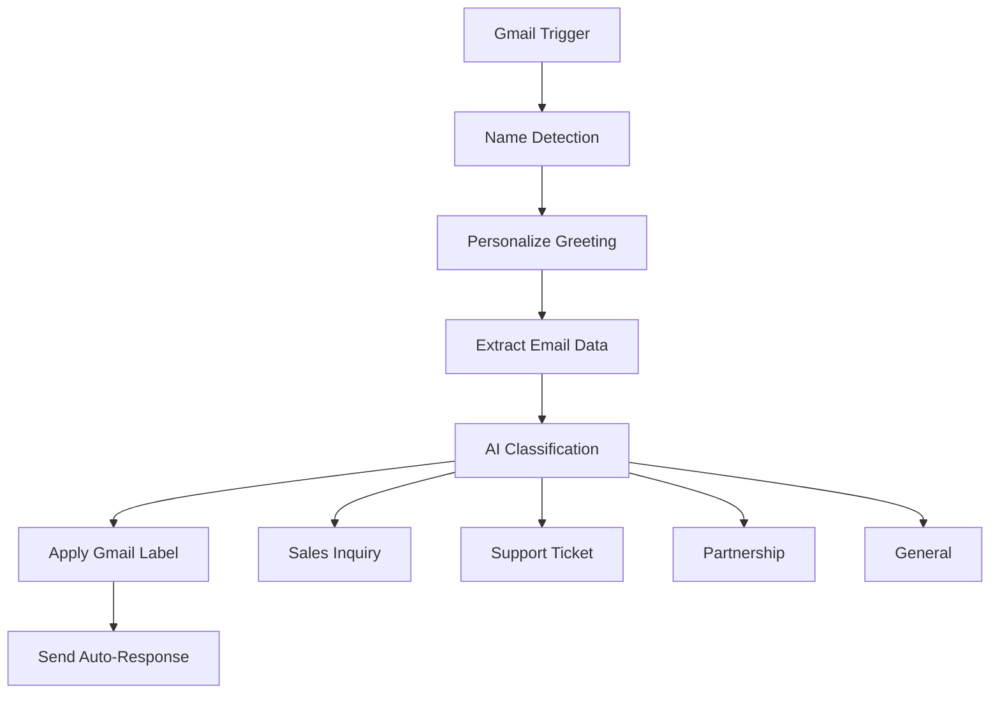

# AI Email Auto-Response Workflow - [Get it for $49](https://yarli.kit.com/products/ai-email-auto-response-workflow)

> Intelligent email automation that never misses a customer inquiry. Automatically classify, label, and respond to emails with AI-powered precision.

[](https://n8n.io)
[](https://developers.google.com/gmail/api)
[](https://openai.com)
[](#license)

## 🚀 Overview

Transform your email management with this intelligent n8n workflow that automatically monitors Gmail, classifies incoming emails using AI, applies appropriate labels, and sends professional auto-responses. Perfect for businesses, consultants, and service providers who want to maintain excellent customer communication while streamlining their email workflow.

### ✨ Key Features

- **🤖 AI-Powered Classification** - Uses GPT-3.5 to intelligently categorize emails
- **⚡ Instant Auto-Responses** - Professional replies sent immediately
- **🏷️ Smart Label Organization** - Automatic Gmail labeling for perfect inbox management
- **👤 Personal Touch** - Dynamic greeting personalization based on sender names
- **🔧 Fully Customizable** - Easy to modify for your specific business needs
- **🌐 Universal Categories** - Works across all industries and business types

## 📊 Workflow Categories

| Category                       | Description                                         | Use Cases                                                     |
| ------------------------------ | --------------------------------------------------- | ------------------------------------------------------------- |
| **Sales & Product Inquiries**  | Product questions, pricing, demos, quotes           | SaaS trials, e-commerce inquiries, service requests           |
| **Support & Technical Issues** | Bug reports, troubleshooting, account help          | Customer support, technical assistance, how-to questions      |
| **Business & Partnership**     | Collaboration proposals, vendor inquiries, B2B      | Partnership opportunities, affiliate programs, joint ventures |
| **General Inquiries**          | Information requests, feedback, misc communications | Company info, testimonials, press inquiries, job applications |

## 🎯 Perfect For

- **SaaS Companies** - Handle trial requests, support tickets, partnership inquiries
- **E-commerce Businesses** - Product questions, customer support, vendor relationships
- **Consultants & Agencies** - New business inquiries, client support, collaborations
- **Service Providers** - Appointment requests, support issues, business development
- **Startups** - Investment inquiries, customer questions, partnership opportunities
- **Any Business** - Universal categories work across all industries

## 📋 Requirements

### Essential Dependencies

| Component          | Purpose                        | Cost                |
| ------------------ | ------------------------------ | ------------------- |
| **n8n Platform**   | Workflow automation platform   | Free tier available |
| **Gmail Account**  | Email monitoring and responses | Free                |
| **OpenRouter API** | AI text classification         | ~$1-5/month         |

### Technical Requirements

- n8n version 1.0+ (self-hosted or cloud)
- Gmail account with API access
- OpenRouter account with GPT-3.5 access
- Basic understanding of n8n workflows (helpful but not required)

## 🚀 Quick Start

### 1. Import Workflow

Extract the AI-Email-Auto-Response-Workflow.json file from zip file.

1. Open your n8n instance or n8n cloud
2. Go to **Workflows** → **Import from File**
3. Upload the `I-Email-Auto-Response-Workflow.json` file
4. Click **Import**

### 2. Configure Gmail Credentials

1. **Enable Gmail API**:

   - Go to [Google Cloud Console](https://console.cloud.google.com/)
   - Create a new project or select existing
   - Enable Gmail API
   - Create OAuth2 credentials

2. **Setup n8n Credentials**:
   - In n8n, go to **Settings** → **Credentials**
   - Create new **Gmail OAuth2** credential
   - Enter your Client ID and Client Secret
   - Complete OAuth authorization
   - Name it "Gmail account"

### 3. Configure OpenRouter API

1. **Get API Key**:

   - Sign up at [OpenRouter](https://openrouter.ai/)
   - Generate API key
   - Add credits to your account

2. **Setup n8n Credentials**:
   - Create new **OpenRouter API** credential
   - Enter your API key
   - Name it "OpenRouter account"

### 4. Customize Gmail Labels (Optional)

Create these labels in Gmail or update the workflow with your existing label IDs:

```
Sales & Product Inquiries    → Label_8881931574887766393
Support & Technical Issues   → Label_1903790887784143828
Business & Partnership       → Label_1851800001259661355
General Inquiries           → Label_237010993939269527
```

### 5. Test & Activate

1. **Test the workflow**:

   - Use n8n's test functionality
   - Send test emails to verify classification
   - Check that labels are applied correctly
   - Confirm auto-responses are sent

2. **Activate**:
   - Click the **Active** toggle
   - Workflow will begin monitoring every minute

## ⚙️ Configuration

### Customizing Email Templates

Edit the Gmail response nodes (Gmail4, Gmail5, Gmail6) to customize your auto-responses:

```javascript
// Example customization in Gmail4 (Sales Inquiries)
"message": "={{ $('Text Classifier').item.json.introduction }}\n\nThank you for your interest in [YOUR COMPANY]!\n\n[YOUR CUSTOM MESSAGE]\n\nBest regards,\n[YOUR NAME]\n[YOUR CONTACT INFO]"
```

### Adjusting Categories

Modify the Text Classifier node to add/change categories:

```json
{
  "category": "Your Custom Category",
  "description": "Detailed description for AI classification"
}
```

### Changing Monitoring Frequency

Update the Gmail Trigger polling interval:

```json
{
  "pollTimes": {
    "item": [
      {
        "mode": "everyMinute" // Options: everyMinute, every5Minutes, every10Minutes, etc.
      }
    ]
  }
}
```

## 🏗️ How It Works



### Detailed Flow

1. **📬 Email Monitoring** - Checks Gmail every minute for unread emails
2. **👤 Name Detection** - Checks if sender name is available for personalization
3. **🏷️ Greeting Creation** - Creates "Dear [Name]" or "Hey," based on availability
4. **📊 Data Extraction** - Captures email body, message ID, thread ID
5. **🤖 AI Classification** - GPT-3.5 analyzes content and categorizes email
6. **🏷️ Label Application** - Applies appropriate Gmail label for organization
7. **📤 Auto-Response** - Sends contextually appropriate professional reply

## 💡 Customization Examples

### For SaaS Companies

```javascript
// Sales Response Template
"Thank you for your interest in [Product Name]!

We'd love to show you how [Product] can help [solve specific problem].

Next steps:
• Schedule a 15-minute demo
• Start your free 14-day trial
• Get custom pricing for your team size

Book a demo: [calendar link]

Best regards,
Sales Team"
```

### For Consultants

```javascript
// Consultation Response Template
"Thank you for reaching out about potential collaboration!

I specialize in [your expertise] and would love to learn more about your project.

Let's schedule a free 30-minute consultation to discuss:
• Your specific challenges and goals
• How I can help achieve your objectives
• Next steps and investment options

Calendar: [your booking link]

Best regards,
[Your Name]"
```

### For E-commerce

```javascript
// Product Inquiry Response
"Thanks for your interest in our products!

Our team will respond within 24 hours with:
• Product availability and specifications
• Bulk pricing options (if applicable)
• Shipping timeframes and costs
• Answers to your specific questions

For immediate assistance: [phone] or [live chat]

Best regards,
Customer Service Team"
```

## 🔧 Troubleshooting

### Common Issues

| Issue                             | Solution                                              |
| --------------------------------- | ----------------------------------------------------- |
| **Gmail authentication failed**   | Verify OAuth2 credentials and Gmail API is enabled    |
| **AI classification not working** | Check OpenRouter API key and account credits          |
| **Labels not applied**            | Verify label IDs exist in your Gmail account          |
| **Auto-responses not sending**    | Check Gmail compose permissions and message threading |
| **High API costs**                | Reduce polling frequency or add email filtering       |

### Debug Steps

1. **Check n8n execution logs** for error details
2. **Test individual nodes** using n8n's test functionality
3. **Verify credentials** are properly configured and authorized
4. **Monitor API usage** on OpenRouter dashboard
5. **Check Gmail quotas** in Google Cloud Console

### Performance Optimization

- **Reduce API calls**: Adjust polling frequency based on email volume
- **Add email filtering**: Skip newsletters/automated emails
- **Improve accuracy**: Refine category descriptions for better classification
- **Monitor costs**: Set up OpenRouter usage alerts

## 📈 Analytics & Monitoring

### Key Metrics to Track

- **Classification accuracy** - Review misclassified emails weekly
- **Response delivery rate** - Monitor for failed auto-responses
- **API costs** - Track OpenRouter usage and optimize
- **Customer feedback** - Survey recipients about auto-response quality

### Monitoring Setup

```javascript
// Add this to workflow for basic logging
console.log(`Email classified as: ${classification}`);
console.log(`Response sent to: ${senderEmail}`);
console.log(`API cost: ${apiUsage}`);
```

## 🔐 Security & Privacy

### Data Protection

- **No email storage** - Workflow processes emails in real-time without storage
- **Credential security** - All API keys stored securely in n8n credentials
- **Access control** - Limit workflow access to authorized team members
- **Regular rotation** - Update API keys and credentials periodically

### Compliance Considerations

- **GDPR compliance** - No personal data is stored permanently
- **Data retention** - Configure according to your business policies
- **Audit logging** - Enable n8n execution logging for compliance
- **Backup strategy** - Regular workflow and credential backups

## 🚀 Advanced Features

### Potential Enhancements

1. **Multi-language Support** - Add language detection and localized responses
2. **Sentiment Analysis** - Adjust response tone based on email sentiment
3. **Priority Scoring** - Flag urgent emails for immediate attention
4. **CRM Integration** - Connect with Salesforce, HubSpot, etc.
5. **Analytics Dashboard** - Track email patterns and response effectiveness
6. **Smart Routing** - Route emails to specific team members
7. **Follow-up Automation** - Automated follow-up sequences
8. **Custom Integrations** - Connect with Slack, Teams, or other tools

### Integration Examples

```javascript
// Slack notification for high-priority emails
if (emailPriority === "urgent") {
  await slackNotify({
    channel: "#sales",
    message: `Urgent email from ${senderName}: ${emailSubject}`,
  });
}
```

## 📊 ROI & Benefits

### Time Savings

- **Immediate responses** - Never miss a customer inquiry again
- **Reduced manual work** - Eliminate repetitive email sorting and initial responses
- **Better organization** - Automatic labeling keeps inbox clean
- **Faster follow-ups** - Know exactly which emails need attention

### Business Impact

- **Improved customer satisfaction** - Instant acknowledgment builds trust
- **Higher conversion rates** - Quick responses lead to more sales
- **Better team productivity** - Focus on high-value activities
- **Professional image** - Consistent, polished communication

### Cost Analysis

| Component            | Monthly Cost | Annual Cost  |
| -------------------- | ------------ | ------------ |
| OpenRouter API       | $1-5         | $12-60       |
| n8n Cloud (optional) | $20-50       | $240-600     |
| **Total**            | **$21-55**   | **$252-660** |

_ROI typically achieved within first month through time savings and improved customer conversion rates._

## 📝 Changelog

### Version 1.0.0 (Current)

- ✅ Initial release with core functionality
- ✅ 4 universal business categories
- ✅ Gmail integration with auto-labeling
- ✅ AI-powered email classification
- ✅ Personalized auto-responses
- ✅ Complete setup documentation

### Planned Updates

- 🔄 Multi-language support
- 🔄 Sentiment analysis integration
- 🔄 Advanced analytics dashboard
- 🔄 CRM integrations (Salesforce, HubSpot)
- 🔄 Mobile app notifications

## 🤝 Support & Community

### Getting Help

- **Documentation**: This README and inline workflow comments
- **Issues**: Report bugs or request features via GitHub issues
- **Community**: Join the n8n community for workflow discussions
- **Custom Development**: Contact for enterprise customizations

### Contributing

We welcome contributions! Areas where you can help:

- 🐛 Bug fixes and improvements
- 🌐 Translation and localization
- 📊 Analytics and reporting features
- 🔌 New integrations and connectors
- 📖 Documentation improvements

## 📄 License

This workflow is available under a **Commercial License**.

### What's Included

- ✅ Complete workflow file
- ✅ Setup and customization documentation
- ✅ Email templates and examples
- ✅ 1 year of free updates
- ✅ Basic implementation support

### Usage Rights

- ✅ Use in commercial environments
- ✅ Modify for your specific needs
- ✅ Deploy across multiple instances
- ❌ Resell or redistribute the workflow
- ❌ Remove attribution or licensing

### Support Terms

- **Setup assistance**: 30 days included
- **Bug fixes**: Covered for 1 year
- **Feature requests**: Considered for future updates
- **Custom development**: Available separately

- For professional support and custom automation solutions: info@yarli.com.au

_Built with ❤️ for the n8n community. Transform your business communication today._

# n8n
